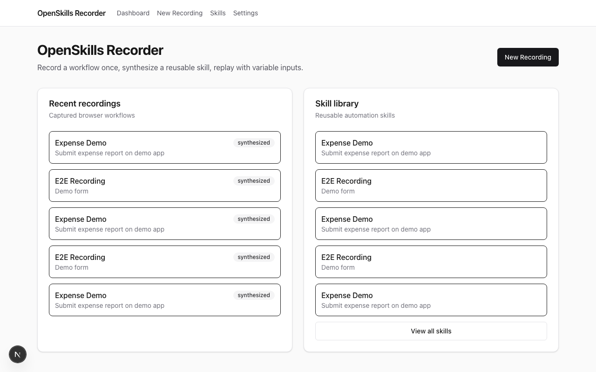
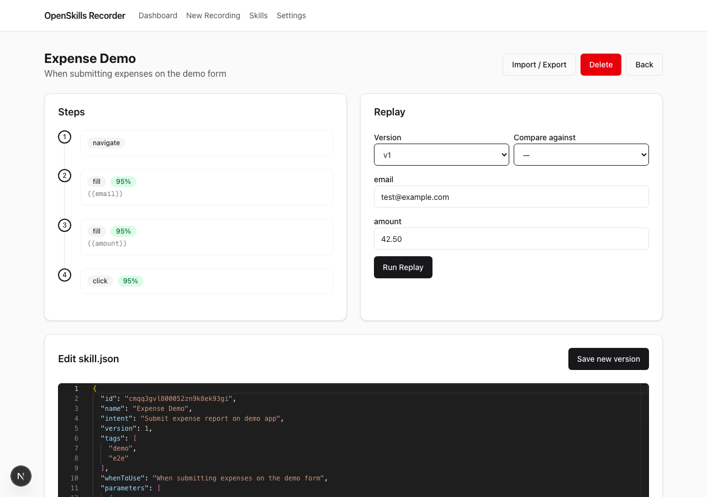
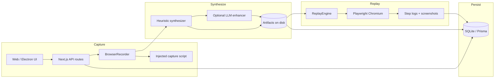

# OpenSkills Recorder

**Record a browser workflow once. Save it as an inspectable skill. Replay it with different inputs.**

<!-- After first push, set GITHUB_USER in scripts/publish-github.sh or replace badges below -->
[](LICENSE)
[](package.json)
[](.github/workflows/ci.yml)
[](#prerequisites)
[](CONTRIBUTING.md)

OpenSkills Recorder is a **local-first, inspectable skill recorder and replay system** for browser workflows.

Demonstrate a task in the browser → synthesize a versioned `skill.json` → edit every step → replay with parameters → inspect run logs. Deterministic Playwright execution comes first; optional LLM enhancement improves metadata, not magic.

> **Not another black-box agent.** This is the middle ground between brittle one-off scripts and opaque AI automation — reusable skills you can read, diff, and ship.

---

## Why this matters

- **Record once, reuse forever** — Turn a live browser session into a parameterized skill artifact, not a throwaway script.
- **Inspectable by default** — Every step, selector, parameter, and warning lives in `skill.json` and human-readable `skill.md`.
- **Deterministic replay first** — Playwright executes steps with selector fallbacks, retries, and verification — no model required.
- **Local and private** — SQLite database and artifacts stay on your machine under `~/.openskills/` unless you export them.

---

## Demo / preview


| Dashboard | Skill editor |
|-----------|--------------|
|  |  |

**Try it locally:** `./scripts/dev.sh` → [localhost:3000](http://localhost:3000) → **New Recording** → demo app at [localhost:4321](http://localhost:4321).

**Skip recording:** import the bundled example skill — **Skills** → **Import / Export** → `fixtures/expense-skill.zip` (see [fixtures/expense-skill/README.md](fixtures/expense-skill/README.md)).

Re-capture assets: `node scripts/capture-demo-assets.mjs` (see [docs/DEMO_SCRIPT.md](docs/DEMO_SCRIPT.md)).

---

## What it does

```
Record  →  Synthesize  →  Edit  →  Replay  →  Inspect
  │            │            │          │           │
  │            │            │          │           └─ Step logs, failure screenshots, run history
  │            │            │          └─ Parameterized Playwright execution
  │            │            └─ JSON editor, version diff, export/import
  │            └─ Heuristic skill.json + skill.md (+ optional LLM metadata polish)
  └─ Playwright browser + injected capture script
```

1. **Record** — Launch a Playwright-controlled browser. Interactions (clicks, fills, navigation, selects, uploads, drags, keypresses) are captured with multi-strategy selectors and optional step screenshots.
2. **Synthesize** — Raw events become a structured skill: steps, inferred parameters, preconditions, success criteria, and synthesis warnings.
3. **Edit** — Inspect the step timeline, edit `skill.json` in Monaco, compare versions, and save as a new version with changelog.
4. **Replay** — Supply parameter values and run the skill. The engine tries primary selectors, then fallbacks, with per-step retry and verification.
5. **Inspect runs** — Replay console shows per-step status, errors, and failure screenshots. Runs are persisted in SQLite with structured logs on disk.

---

## Why this project exists

| Approach | Problem |
|----------|---------|
| **Ad-hoc scripts** | Break when the UI changes. No shared artifact format. Hard to hand off. |
| **Traditional RPA** | Heavy, expensive, often cloud-tied. Skills are opaque to developers. |
| **Black-box AI agents** | Hard to debug, non-deterministic, poor fit for repeatable ops workflows. |

OpenSkills Recorder targets teams who need **repeatable browser automation with full visibility**: AI builders, automation engineers, PMs/ops, educators, and developers who want skills they can version, diff, and share — not prompts that vanish into a model.

---

## Features

### Implemented now

- **Browser workflow recording** — Playwright + injected capture script (`packages/recorder`)
- **Multi-strategy selectors** — `testid`, `aria`, `role`, `css`, `text`, `xpath` with confidence scores
- **Heuristic skill synthesis** — Events → `skill.json` + `skill.md` + `SKILL.md` (`packages/synthesis`)
- **Deterministic replay engine** — Selector fallbacks, retries, step verification, success criteria (`packages/replay`)
- **Skill library UI** — Search, tag filter, soft-delete, version history
- **Skill editor** — Monaco JSON editor, step timeline, version diff, screenshot thumbnails
- **Export / import** — ZIP export (skill + screenshots); JSON import
- **Replay console** — Live step logs, error filter, cancel in-flight replays, failure screenshots
- **Web app** — Next.js 15 dashboard, recording flow, settings, REST API routes
- **Electron desktop shell** — Optional native wrapper with IPC + WebSocket live events
- **SQLite + Prisma persistence** — Recordings, skills, versions, replay runs, step logs
- **Structured logging** — pino loggers across packages
- **Demo app + E2E tests** — Expense form fixture at `:4321`, Playwright full-flow test
- **CI** — GitHub Actions: build, unit tests, web build, E2E

### Experimental

- **LLM enhancement during synthesis** — Optional polish of `whenToUse`, `description`, and parameter labels via Ollama or OpenAI-compatible APIs. Steps are **not** LLM-generated; heuristic synthesis is always the base. Falls back silently on LLM errors.
- **Electron desktop distribution** — `pnpm dist:desktop` builds via electron-builder; packaging maturity is early (v0.1.0).

### Planned

- **Desktop scope recording** — UI shows "Desktop (coming soon)"; `desktop` scope exists in schema but is not supported
- **Iframe-aware replay** — Iframe interactions are recorded with warnings; replay does not yet target iframe contexts
- **Skill marketplace / registry** — Share and discover community skills
- **CI/CD replay adapters** — GitHub Actions, scheduled runs, webhook triggers
- **Cross-browser recording** — Chromium only today

---

## How it works



**Monorepo layout (Turbo + pnpm):**

| Layer | Package / app | Role |
|-------|---------------|------|
| UI | `apps/web` | Next.js 15 App Router — dashboard, recording, skill library, settings, API |
| Shell | `apps/desktop` | Electron — Playwright sidecar, IPC bridge, WebSocket event stream |
| Core | `packages/core` | Zod schemas, paths, logger, event bus, skill diff |
| Data | `packages/db` | Prisma + SQLite models |
| Capture | `packages/recorder` | Browser launch, init script, selector building |
| Synthesis | `packages/synthesis` | Heuristic event→skill, markdown render |
| Execution | `packages/replay` | Deterministic step executor, cancel registry |
| AI | `packages/ai` | Ollama / OpenAI-compatible provider for metadata enhancement |
| Fixture | `fixtures/demo-app` | Static expense form for local dev and E2E |

**Runtime modes:**

- **Web dev (default)** — `pnpm dev` runs the Next.js app. Recording/replay APIs spawn Playwright directly on the server process.
- **Electron (optional)** — Desktop shell owns Playwright; UI talks via `window.openskills` IPC + WebSocket (`OPENSKILLS_WS_PORT`, default `3847`).

---

## Tech stack

| Category | Technology |
|----------|------------|
| Language | TypeScript 5.7 |
| Runtime | Node.js 22+ |
| Monorepo | pnpm 9 workspaces, Turbo 2 |
| Web UI | Next.js 15, React 19, Tailwind CSS 4, Radix UI, Monaco Editor |
| Desktop | Electron 33, electron-builder |
| Browser automation | Playwright (Chromium) |
| Database | SQLite via Prisma 6 |
| Validation | Zod |
| Logging | pino |
| Testing | Vitest (packages), Playwright Test (E2E) |
| Optional AI | Ollama, OpenAI-compatible HTTP APIs |

---

## Getting started

### Prerequisites

- **Node.js 22+** (matches CI)
- **pnpm 9** — `corepack enable && corepack prepare pnpm@9.15.0 --activate`
- **Playwright Chromium** — installed automatically on first run, or manually:

```bash
npx playwright install chromium
```

### Quick start (recommended)

```bash
git clone <your-repo-url>
cd openskills-recorder
cp .env.example .env
chmod +x scripts/dev.sh
./scripts/dev.sh
```

This script runs `pnpm install`, `db:generate`, `db:push`, `build:packages`, then starts:

| Service | URL |
|---------|-----|
| Web UI | [http://localhost:3000](http://localhost:3000) |
| Demo app | [http://localhost:4321](http://localhost:4321) |
| Electron | Opens automatically (if included in dev) |

### Manual setup

```bash
pnpm install
cp .env.example .env
pnpm db:generate && pnpm db:push
pnpm build:packages
pnpm dev
```

### Environment variables

Copy the example file and edit if needed:

```bash
cp .env.example .env
```

See [`.env.example`](.env.example) for all options. Key variables:

| Variable | Default | Description |
|----------|---------|-------------|
| `DATABASE_URL` | `file:~/.openskills/openskills.db` | Prisma SQLite connection |
| `OPENSKILLS_DATA_DIR` | `~/.openskills` | Base directory for artifacts and logs |
| `OPENSKILLS_WS_PORT` | `3847` | WebSocket port for live recording events (Electron) |
| `OPENSKILLS_WEB_URL` | `http://localhost:3000` | URL loaded by Electron shell |

### Optional: local LLM (Ollama)

```bash
docker compose up -d ollama
```

Then in the web UI → **Settings** → enable **LLM enhancement** and choose Ollama (default `http://localhost:11434`, model `llama3.2`).

### Electron (optional)

```bash
pnpm --filter @openskills/desktop build
pnpm --filter @openskills/web dev &
pnpm --filter @openskills/desktop dev
```

Build distributable:

```bash
pnpm dist:desktop
```

### Run tests

```bash
# Unit tests (core, synthesis, replay, recorder)
pnpm test

# E2E (starts demo app + web server automatically)
pnpm test:e2e
```

### Production build

```bash
pnpm build
pnpm --filter @openskills/web start   # serves on :3000
```

---

## Usage

### Import example skill (no recording required)

```bash
# UI: Skills → Import / Export → fixtures/expense-skill.zip

# Or via API:
curl -X POST http://localhost:3000/api/skills/import \
  -H "Content-Type: application/json" \
  -d @fixtures/expense-skill.json
```

Then open the skill, set `email` / `amount`, and **Run Replay** against the demo app.

### End-to-end workflow (UI)

1. Open [http://localhost:3000](http://localhost:3000) → **New Recording**
2. Fill in name, intent, tags, scope (`session` recommended), and start URL (demo: `http://localhost:4321`)
3. Click **Start Recording** — a Chromium window opens. Perform your workflow.
4. Click **Stop & Synthesize** — you are redirected to the skill detail page.
5. Review steps, edit JSON if needed, **Save** (creates a new version).
6. Fill replay parameters → **Run Replay** → inspect the replay console.

### Recording scopes

| Scope | Status | Description |
|-------|--------|-------------|
| `session` | Supported | Persistent browser context across navigations (default) |
| `tab` | Supported | Single tab in a launched browser |
| `desktop` | **Not yet** | Shown as "coming soon" in UI |

### API examples

**Start recording:**

```bash
curl -X POST http://localhost:3000/api/recordings/start \
  -H "Content-Type: application/json" \
  -d '{
    "name": "Submit expense",
    "intent": "Fill and submit the expense form",
    "tags": ["demo"],
    "scope": "session",
    "startUrl": "http://localhost:4321"
  }'
```

**Stop recording:**

```bash
curl -X POST http://localhost:3000/api/recordings/{recordingId}/stop
```

**Synthesize skill:**

```bash
curl -X POST http://localhost:3000/api/recordings/{recordingId}/synthesize \
  -H "Content-Type: application/json" \
  -d '{ "useLlm": false }'
```

**Replay:**

```bash
curl -X POST http://localhost:3000/api/replays \
  -H "Content-Type: application/json" \
  -d '{
    "skillVersionId": "<version-id>",
    "inputs": { "email": "you@company.com" },
    "headless": true
  }'
```

**Export skill (ZIP):**

```bash
curl -OJ "http://localhost:3000/api/skills/{skillId}/export"
```

### Artifact layout on disk

```
~/.openskills/
├── openskills.db
├── logs/
│   └── replays/{runId}.json
└── artifacts/{recordingId}/
    ├── recording.json
    ├── synthesis.log
    ├── screenshots/step-NNN.png
    └── skill/v{N}/
        ├── skill.json      # Canonical skill definition
        ├── skill.md        # Human-readable docs
        └── SKILL.md        # Copy for agent/skill consumers
```

---

## Project structure

```
openskills-recorder/
├── apps/
│   ├── web/                 # Next.js UI + API — primary entry point
│   └── desktop/             # Electron shell (optional)
├── packages/
│   ├── core/                # Schemas (Zod), paths, logger, skill diff
│   ├── db/                  # Prisma schema + client
│   ├── recorder/            # Playwright recording + inject script + selectors
│   ├── synthesis/           # Heuristic synthesis + markdown renderer
│   ├── replay/              # Deterministic replay engine
│   ├── ai/                  # LLM provider abstraction (metadata only)
│   └── desktop-adapter/     # Shared desktop bridge types/helpers
├── fixtures/demo-app/       # Static expense form for dev/E2E
├── e2e/                     # Playwright end-to-end tests
├── scripts/dev.sh           # One-command local bootstrap
└── .github/workflows/ci.yml
```

**Where to start reading code:**

- Recording flow: `apps/web/src/app/api/recordings/` → `packages/recorder/src/browser-recorder.ts`
- Synthesis: `packages/synthesis/src/heuristic.ts`
- Replay: `packages/replay/src/engine.ts`
- Skill schema: `packages/core/src/schemas.ts`

---

## Skill format

Skills are validated by `SkillSchema` in `@openskills/core`. The canonical artifact is `skill.json`; `skill.md` / `SKILL.md` are generated for humans and agent consumers.

**Supported step actions:** `navigate`, `click`, `fill`, `select`, `keypress`, `drag`, `upload`, `wait`

**Example (abbreviated):**

```json
{
  "id": "skill-abc123",
  "name": "Submit expense",
  "intent": "Fill and submit the expense reimbursement form",
  "version": 1,
  "tags": ["demo", "expense"],
  "whenToUse": "When submitting a new expense report",
  "parameters": [
    {
      "name": "email",
      "type": "string",
      "required": true,
      "description": "Value for Email",
      "example": "you@company.com"
    }
  ],
  "preconditions": [
    {
      "type": "url",
      "rule": "http://localhost:4321/",
      "message": "Start from recorded entry URL or equivalent"
    }
  ],
  "steps": [
    {
      "id": "step-1",
      "action": "navigate",
      "selectors": [],
      "fallbacks": [],
      "value": "http://localhost:4321/",
      "description": "Navigate to http://localhost:4321/"
    },
    {
      "id": "step-2",
      "action": "fill",
      "selectors": [
        { "strategy": "testid", "value": "[data-testid=\"email\"]", "confidence": 0.95 }
      ],
      "fallbacks": [],
      "parameterRef": "email",
      "retry": { "attempts": 3, "delayMs": 500 },
      "description": "Fill email"
    },
    {
      "id": "step-3",
      "action": "click",
      "selectors": [
        { "strategy": "testid", "value": "[data-testid=\"submit\"]", "confidence": 0.95 }
      ],
      "fallbacks": [],
      "retry": { "attempts": 3, "delayMs": 500 },
      "description": "Click Submit expense"
    }
  ],
  "successCriteria": [
    {
      "type": "urlContains",
      "rule": "/success",
      "message": "Final page reached"
    }
  ],
  "warnings": [],
  "sourceRecordingId": "rec-xyz789"
}
```

Each manual save or synthesis creates a new version under `skill/v{N}/`. Use the version diff UI or `GET /api/skills/versions/{id}/diff?against={otherId}` to compare.

---

## Roadmap

### Near-term

- [x] Add demo GIF and screenshots to README
- [ ] Desktop scope recording (native app capture)
- [ ] Iframe-aware selector targeting and replay
- [ ] Replay reliability improvements for dynamic SPAs
- [x] `.env.example` committed to repo
- [x] `CONTRIBUTING.md` and issue templates

### Longer-term

- [ ] Skill registry / sharing hub
- [ ] GitHub Actions adapter (replay skills in CI)
- [ ] Firefox / WebKit recording support
- [ ] Scheduled and webhook-triggered replays
- [ ] Team sync (optional remote artifact store)

---

## Contributing

See [CONTRIBUTING.md](CONTRIBUTING.md) for setup, tests, and PR guidelines.

Contributions welcome — especially selector heuristics, replay edge cases, docs, and demo skills.

**Good first issues:**

- Improve synthesis warnings for weak selectors
- Add more E2E scenarios to `fixtures/demo-app`
- Document skill format edge cases
- Harden Electron packaging on macOS / Windows / Linux

**How to contribute:**

1. Fork the repo and create a branch from `main`
2. Run `./scripts/dev.sh` and confirm `pnpm test && pnpm test:e2e` pass
3. Open a PR with a clear description and test plan

**Before opening a feature PR:** open an issue to discuss scope — the project is v0.1.0 and APIs may still move.

Bug reports: include OS, Node version, recording scope, target URL, and relevant logs from `~/.openskills/logs/`.

---

## Design principles

| Principle | What it means here |
|-----------|-------------------|
| **Local-first** | SQLite + filesystem artifacts. No cloud account required. |
| **Inspectable artifacts** | `skill.json` is the source of truth — readable, diffable, exportable. |
| **Deterministic replay first** | Playwright executes steps predictably; LLM is optional metadata polish. |
| **AI as assistant, not magic** | LLM enhances descriptions and parameter labels; it does not invent steps. |
| **Privacy-aware defaults** | Data stays on disk. Domain blacklist in Settings. LLM is opt-in. |
| **Version everything** | Skills, edits, and replays are versioned and logged. |

---

## Known limitations

- **v0.1.0 / early stage** — APIs and artifact layout may change.
- **Chromium only** — Recording and replay use Playwright Chromium.
- **Headful recording** — Recording opens a visible browser window; server-side recording requires a display (or appropriate headless setup — not the default UX).
- **Dynamic UIs** — SPAs with volatile selectors may produce weak steps; synthesis warnings flag these but do not auto-fix them.
- **Iframe interactions** — Recorded with warnings; replay targets the main page context only.
- **File uploads** — Synthesized as `file`-type parameters; you must supply valid local paths at replay time.
- **LLM enhancement scope** — Metadata only (`whenToUse`, `description`, parameter labels). Does not rewrite step logic.
- **Desktop / native recording** — Not implemented (`desktop` scope disabled in UI).

### Publish to GitHub

After `gh auth login`:

```bash
./scripts/publish-github.sh
```

See [docs/LAUNCH.md](docs/LAUNCH.md) for social copy after publishing.

---

## License

[MIT](LICENSE) — Copyright (c) 2026 OpenSkills Recorder Contributors

---

## Star & community

If OpenSkills Recorder saves you from rewriting the same browser workflow twice:

- **Star the repo** — it helps others find inspectable automation tooling
- **Open an issue** — share a workflow that breaks synthesis or replay
- **Export a skill** — contribute anonymized demo skills (no credentials)
- **Build an adapter** — CI runners, schedulers, and chatops integrations are welcome

**Suggested GitHub topics:** `browser-automation`, `playwright`, `workflow-recording`, `rpa`, `skill-recorder`, `local-first`, `electron`, `nextjs`, `deterministic-automation`, `ai-agents`, `typescript`

**Suggested launch copy (X / HN / Reddit):**

> OpenSkills Recorder (OSS): record a browser workflow once → get a versioned, inspectable skill.json → replay with inputs via deterministic Playwright. Local-first, SQLite, optional Ollama for metadata polish. Not a black-box agent — the skill is the artifact. v0.1.0, MIT.
